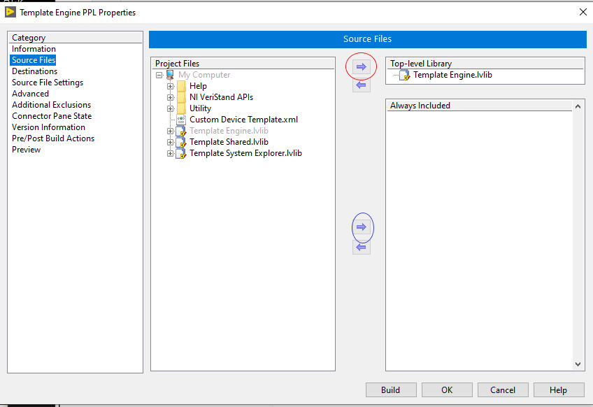
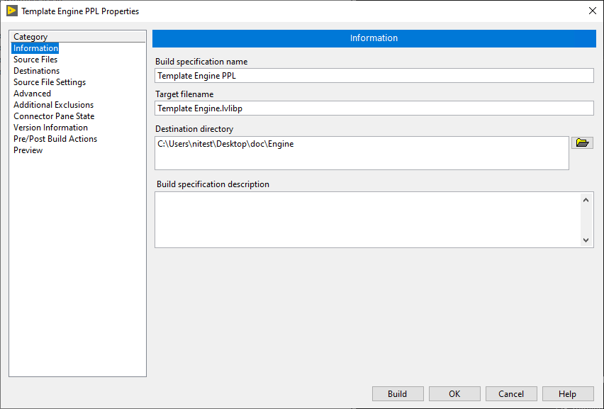

## Migrating a Custom Device from LLB to PPL

First introduced with LabVIEW 2010, a packed project library is a compiled .lvlib that contains all of the .lvlib’s VIs and allows the user to call the public VIs in a manner that is identical to the use of the original .lvlib. Since 
LabVIEW 2017 you can compile a packed project library to be also used with newer versions of LabVIEW. This option is enabled by default, but if you want to change that setting, choose "Advanced" in the sidebar and disable the option "Allow future versions of LabVIEW" to load this packed library. 
Using PPLs for packaging VeriStand Custom Devices does not eliminate the usage of LLBs for the same purpose. A developer does not have to chose between using one or another. The two options can coexist as part of the same project. A developer can keep the existing LLB build specifications and simply add to the project the additional PPL ones. Of course, it might be necessary to modify the CD source code in order to be able to support both options - this will be discussed below. The XML configuration file would have to be modified as well to reflect the new loading paths for the CD elements. 

### Advantages of using PPL based Custom Devices

Packed Project Libraries (PPL) provide name spacing for all of its contained items and preserve the file hierarchy of the source project library. These features result in several potential benefits for a Custom Device packed in a PPL:
* Even if two given custom devices would reference the same file (VI) dependency, by packaging them into PPLs, each custom device would receive its own copy of the required dependency. This would be compiled and included in its respective PPL via name spacing for the contained items, the PPLs would also make sure that load-time conflicts are avoided.

* Since PPLs preserve the file hierarchy of the source project library, that solves the issue of internal naming conflicts, which is specific to LLBs (which causes compile-time warnings and extra files to be generated). Multiple LabVIEW project libraries can be included in the same PPL, even if those contain items with the same name. This is the same reason why LabVIEW classes could now be easier used when building VeriStand Custom Devices.

* Much smaller disk footprint, which is important for a lot of our customers, since it would have a large impact on the deployment time (as you can see for the FPGA Addon below). 

### Drawbacks of using Packed Project Libraries with VeriStand Custom Devices

* Probably one of the main issues is that inside the PPL, relative paths for the items are maintained starting from the most common directory on the disk. This can be confusing for LabVIEW developers that would expect the relative paths to start from the root of the library and follow the original project structure. Additionally, it also means that changing the organization, or location on the disk, of the items that are included in the library build specification could in turn affect the relative paths of the items in the packed library. In time, this behavior could prove to be quite a challenge (or at least a nuisance), since changes within the custom device folder structure could affect the organization of the items in the generated packed library. In turn, this would create the need to constantly update the configuration XML file with the new paths. The long-term solution to this issue would be to create a post-build step that could perform these operations automatically: i.e. parse the configuration XML file and identify the items with "path" properties. For each item, find the corresponding element within the generated packed library and update the configuration file. Once the update is complete (and with no errors), copy the resulting files to the VeriStand Custom Device directory. Certain LabVIEW features are not compatible with packed project libraries. For instance, malleable VIs (VIMs) cannot be included in a PPL and exported as public members, they can only be set with private scope. Implicitly, if a custom device code makes use of malleable VIs, packing it inside a PPL would require some changes (to either the code or the project level) to maintain compatibility.

* Certain VeriStand Custom Device APIs (like the NI VeriStand Custom Device Channel APIs) are using the Global Data References 

* Mutation code might be required for individual custom devices if custom data types (for instance, clusters) are used internally and stored within the System Definition file, if we want to ensure backwards compatibility. 
### Implementing a PPL based Custom Device

For creating a new packed project library based Custom Device you will begin by building a template project. You can find the necessary template here: [VeriStand Custom Device Wizard](https://github.com/ni/niveristand-custom-device-wizard/releases). The new template will be available starting with VeriStand 2021 (Custom Device Wizard LabView 2021 support 21.0). 
### Migrating an existing Custom Device

First step for migrating an existing Custom Device is to make some changes regarding the global data references if you use certain VeriStand Custom Device APIs.
For performance reasons, channel values are stored in VeriStand as a single block of data - i.e. as an array of double values. To be able to access a value element corresponding to a given channel, VeriStand is using Global Variables to pass pointer information, from the engine, to the calling APIs. While this works well for custom devices packed in LLBs, the same does not apply for packed project libraries, due to namespacing. Essentially, when compiling a PPL, a separate (namespaced) copy of the global variable is created and included with it. In turn, it cannot be used anymore for data transfer between the VeriStand engine and the running custom device and would result in a runtime error. Custom devices that do not use this kind of APIs are not affected by this issue. For instance, mainly Inline custom devices ( and derivatives of this type) are affected, since custom devices of Async type are using RT FIFOs to access channel values.
To be able to mitigate this problem, we need to implement an  alternative way to access the values within these global variables. 
This code needs to be incapsulated within a single VI ("Initialize Global Variables"). It has to be called only once from within the target custom device and, for an Inline type, it would have to be called specifically in the "Read Data from HW" state of the "RT Driver" due to the specifics of the initialization of the VeriStand engine.

The next step is to create a packed project library for each LLB you have in the project. The PPL needs to have the same configuration. To do so, you need to right click on **Built Specifications** » **New** » **Packed Library**. 

The window for configurating your packed library will open. 
* You need to select **Source Files** in the left menu. You will have a list with all the LLBs in your project and you need to select one for which you want to copy the configuration. After you select it you will need to press the top blue arrow (the one circled in RED).

**Note:** if you need an LLB configuration to be included in one PPL, Select the LLB you want to include and Press the bottom blue arrow (the one circled in BLUE).

* Select **Information** from the left menu, and rename the PPL as you wish in the **Build Specification Name** field.

**Note:** Check the **Destionation Directory** field, in some cases you might need to change the path.

* Press **Done** and you should see this window: 

After you are done check if you have a PPL for each LLB. 

**Note:** You should be carefull to configure PPL for the targets too.

The last step is to make the necessary changes in the XML file. For this you will need to change the path for each LLB with the path of each coresponding PPL.
For example, the following image represents  the XML code sequence for the custom device RT Driver VI on a Windows target. 

You need to change what comes after the **<Path>** tag.

Here you can see the Path is changed to the one that the PPL has. You need to do the same for every **<Path>** tag in the XML.

**Note:** Do not forget about the Real Time destination.

