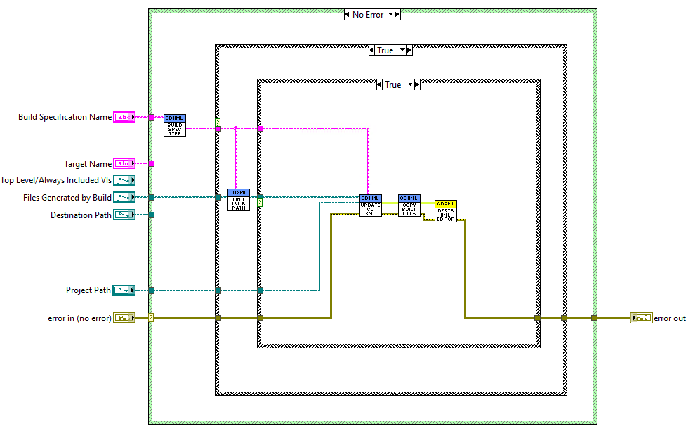
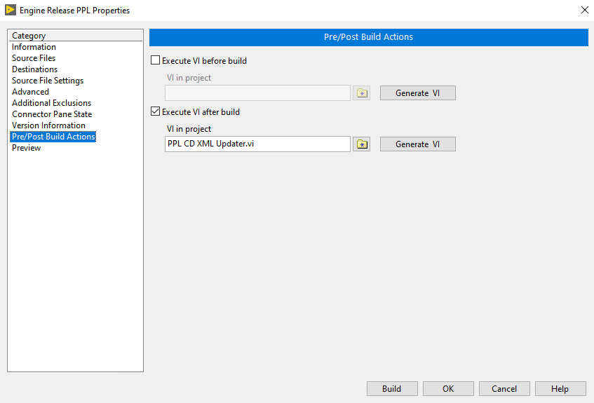
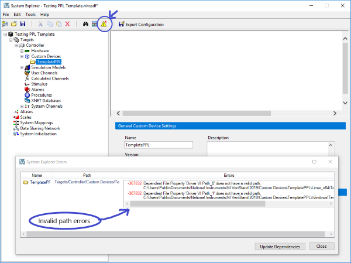
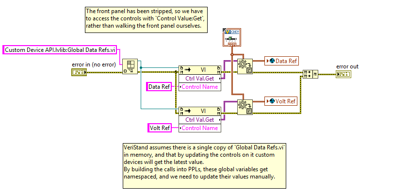

## Migrating from LLB to PPL

First introduced with LabVIEW 2010, a packed project library (PPL) is a compiled LabVIEW project library (.lvlib) that contains all of the .project library VIs and allows the user to call the public VIs in a manner that is identical to the use of the original .project library. Since LabVIEW 2017 you can compile a packed project library to be also used with newer versions of LabVIEW. This option is enabled by default, but if you want to change that setting, choose "Advanced" in the sidebar and disable the option "Allow future versions of LabVIEW" to load this packed library. 

Using PPLs for packaging VeriStand Custom Devices does not eliminate the usage of LLBs for the same purpose. A developer does not have to chose between using one or another. The two options can coexist as part of the same project. A developer can keep the existing LLB build specifications and simply add to the project the additional PPL ones. Of course, it might be necessary to modify the CD source code in order to be able to support both options. The XML configuration file would have to be modified as well to reflect the new loading paths for the CD elements.

### Benefits for using PPL based Custom Devices

Packed Project Libraries (PPL) provide name spacing for all of its contained items and preserve the file hierarchy of the source project library. These features result in several potential benefits for a Custom Device packed in a PPL:
* If two given custom devices would reference the same VI dependency, by packaging them into PPLs, each custom device would receive its own copy of the required dependency. This would be compiled and included in its respective PPL via namespacing for the contained items. The PPLs would also make sure that load-time conflicts are avoided.

* Since PPLs preserve the file hierarchy of the source project library, that solves the issue of internal naming conflicts, which is specific to LLBs (which causes compile-time warnings and extra files to be generated). Multiple LabVIEW project libraries can be included in the same PPL, even if those contain items with the same name. This is the same reason why LabVIEW classes could now be easier used when building VeriStand Custom Devices.

* Much smaller disk footprint, which would improve the deployment time (as you can see for the FPGA Addon below). . 

### Drawbacks of using PPL based Custom Devices

* One of the main drawback is that inside the PPL, relative paths for the items are maintained starting from the most common directory on disk. This can be confusing for LabVIEW developers that would expect the relative paths to start from the root of the library and follow the original project structure. Additionally, it also means that changing the organization, or location on disk, of the items that are included in the library build specification could in turn affect the relative paths of the items in the packed library. In time, this behavior could prove to be quite a challenge, since changes within the custom device folder structure could affect the organization of the items in the generated packed library. In turn, this would create the need to constantly update the configuration XML file with the new paths. The long-term solution would be implementing a VI that automatically updates the XML file (see below). You can also see it implemented in [FPGA Add-on Custom Device](https://github.com/ni/niveristand-fpga-addon-custom-device) and will be available in the Wizard.

This VI must execute after every PPL build, so what we need to do in addition is to select this VI to run after build when we configure the PPL (see below). 

* Certain LabVIEW features are not compatible with packed project libraries. For instance, malleable VIs (VIMs) cannot be included in a PPL and exported as public members, they can only be set with private scope. Implicitly, if a custom device code makes use of malleable VIs, packing it inside a PPL would require some changes (to either the code or the project level) to maintain compatibility.

* When you open the Custom Device in Veristand you might see an error regarding the invalid path for some of the VIs (as you can see in the image below).

This is happening because Veristand Engine is not completly compatible with PPLs, and it doesn't recognize some paths from PPLs. However, this does not affect how your Custom Device runs. The solution would be to change the code of the **Initialization** VI and **Action on Compile** VI (as tou can see below).A good example (where you can see the exact structure of the VI) is implemented on [FPGA Add-on Custom Device](https://github.com/ni/niveristand-fpga-addon-custom-device) and will be available in the Wizard. 

* Certain VeriStand Custom Device APIs (like the NI VeriStand Custom Device Channel APIs) are using Global Data References. 

### Implementing a PPL based Custom Device

For creating a new packed project library based Custom Device you can start from a Custom Device template project. You can choose one for your application from the [VeriStand Custom Device Wizard](https://github.com/ni/niveristand-custom-device-wizard/releases). 
### Migrating to a PPL based Custom Device from an LLB one

#1. Changes regarding global data references
If you use certain VeriStand Custom Device APIs, which is the case for an inline custom device, the first step to migrate an existing Custom Device would include changes regarding how the global data references are initialized.
For performance reasons, channel values are stored in VeriStand as a single block of data - i.e. as an array of double values. To be able to access a value element corresponding to a given channel, VeriStand is using Global Variables to pass pointer information, from the engine, to the calling APIs. While this works well for custom devices packed in LLBs, the same does not apply for packed project libraries, due to namespacing. Essentially, when compiling a PPL, a separate (namespaced) copy of the global variable is created and included with it. In turn, it cannot be used anymore for data transfer between the VeriStand engine and the running custom device and would result in a runtime error. To be able to mitigate this problem, we need to implement an alternative way to access the values within these global variables.
The initialization code below needs to be incapsulated within a subVI ("Initialize Global Variables"). It has to be called only once from within the target custom device and, for an Inline type, it would have to be called specifically in the "Read Data from HW" case of the "RT Driver" due to how the VeriStand engine initializes.

#2. Changes regarding libraries
The next step is to create a packed project library for each LLB build specification you have in the project. The PPL needs to have the same configuration. To do so, you need to right click on **Built Specifications** » **New** » **Packed Library**. 

The window for configuring your packed library will open. 
* You need to select **Source Files** in the left menu. You will have a list with all the LLBs in your project and you need to select one for which you want to copy the configuration. After you select it you will need to press the top blue arrow (the one circled in RED).

**Note:** if you need to include something in the PPL (for exemple the XML file in the System Explorer PPL), select the the file you want to include and press the bottom blue arrow (the one circled in BLUE).

* Select **Information** from the left menu and rename the PPL in the **Build Specification Name** field. There are some rules you need to consider in order to avoid conflicts:
	* The name of the file should be **Custom Device Name** + **Configuration**(for System Explorer) or **Custom Device Name** + **Engine** + **Operating System Name**(for Engine)
	* The path should have the following structure: **"..\build\Custom Device Name\Windows** 

**Note:** Check the **Destionation Directory** field, in some cases you might need to change the path.

* Select **Destionations** and choose the apropriate path. 

* Press **Build** and you should see this window after the build finishes:

After you are done check if you have a PPL for each LLB. 

**Note:** You should configure PPLs also for the Real Time targets build specifications.

#3. Changes regarding the XML
The last step is to make the necessary changes in the XML file. For this you will need to change the path for each LLB with the path of each corresponding PPL.
For example, the following image represents the XML code sequence for the custom device RT Driver VI on a Windows target. 

You need to change what comes after the <Path> tag.

Here you can see the <Path> contains a path for a VI located inside a PPL. You need to update all the <<Path>> tags in the XML that reference VIs inside the newly created PPLs.

**Note:** You need to update also the <RealTimeSystemDestination> tags.

